# CLI命令行实用程序开发实战 - Agenda
## 任务目标
完成agenda项目开发中至少两项功能的实现
## 实验准备
### 安装cobra
在终端使用命令 `go get -v github.com/spf13/cobra/cobra`，这是出现了以下报错信息：
```
Fetching https://golang.org/x/sys/unix?go-get=1
https fetch failed: Get https://golang.org/x/sys/unix?go-get=1: dial tcp 216.239.37.1:443: i/o timeout
```
这是因为 sys 和 text 这两个包没有下载成功，在`$GOPATH/src/golang.org/x`目录下用以下指令从github上下载即可：
```
git clone https://github.com/golang/sys
git clone https://githubcom/golang/text
```
接着使用命令 `go install github.com/spf13/cobra/cobra` 安装cobra。
如图，可以检验cobra安装成功。

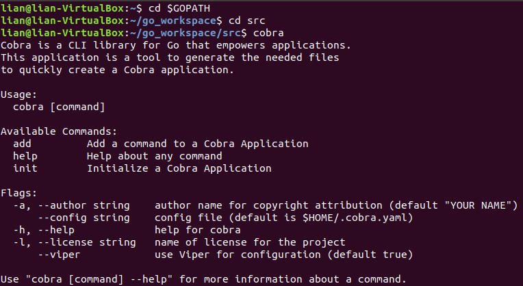

### cobra的简单使用
按如下步骤创建一个小程序。

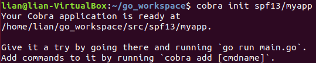

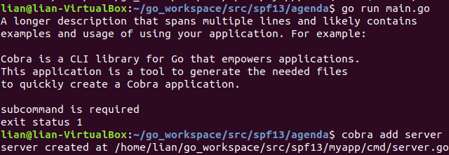

打开生成的server.go文件，在`init`中添加：
```go
registerCmd.Flags().StringP("user", "u", "Anonymous", "Help message for username")
```
在`run`中添加：
```go
username, _ := cmd.Flags().GetString("user")
fmt.Println("register called by " + username)
```
修改后的server.go如图所示。

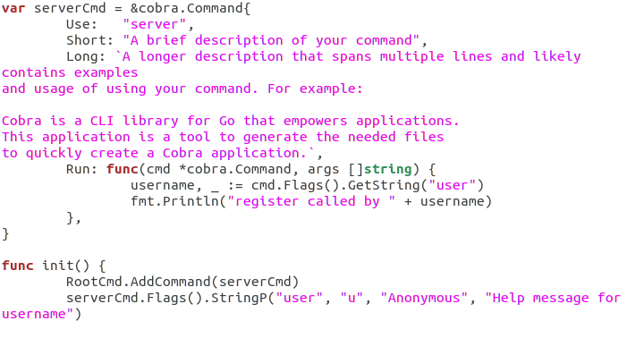

在终端使用命令`go run main.go server --user=Testuser`进行测试，结果如图所示。

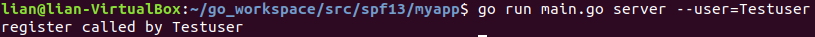

## 项目开发
### 功能实现
本次实验我一共实现了三个功能，分别是register、login和logout。
* register：用户注册。需要设置唯一的用户名，密码，邮箱和电话信息。如果注册时提供的用户名已由其他用户使用，应反馈一个适当的出错信息；成功注册后，亦应反馈一个成功注册的信息。
* login：用户登录。只能使用已注册的用户名和相应的密码登录agenda系统，用户名和密码同时正确则登录成功并反馈一个成功登录的信息，否则，登录失败并反馈一个失败登录的信息。
* logout：用户登出。从正在登录的列表中销去该用户。
### 测试结果
register：

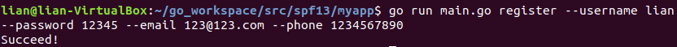

在User.json文件中可以看到成功注册的用户

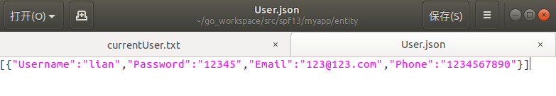

用户名重复注册将会报错

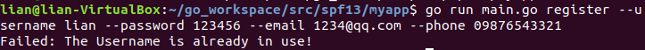

login：

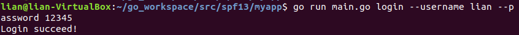

在currentUser.txt文件中可以看到当前登录的用户

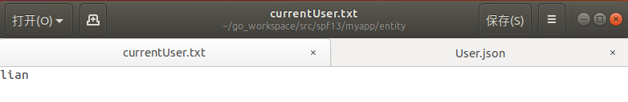

用户名或密码错误将无法成功登录

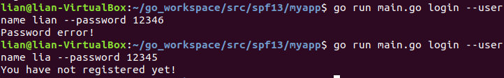

logout：

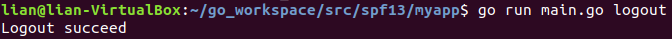

在currentUser.txt文件中可以看到当前没有用户正在登录

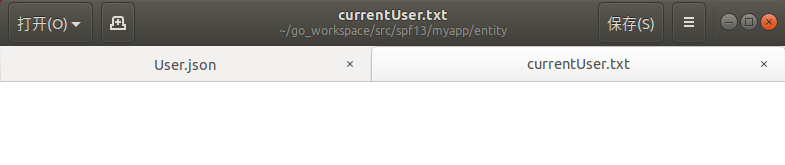
